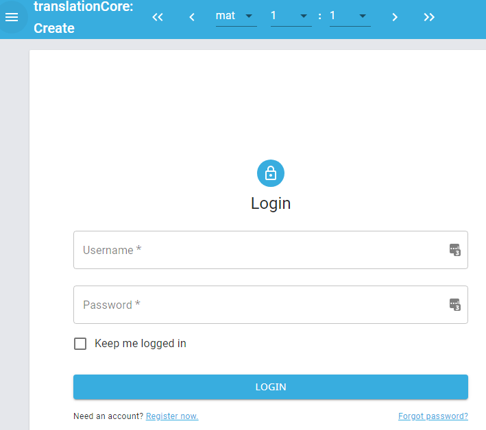
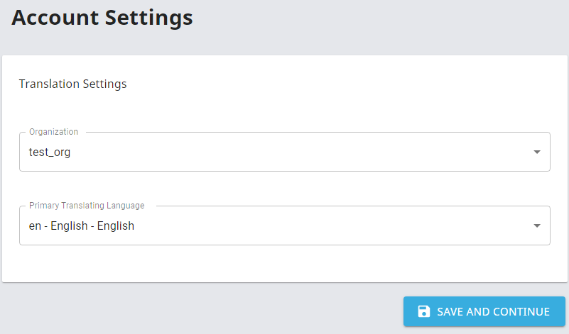
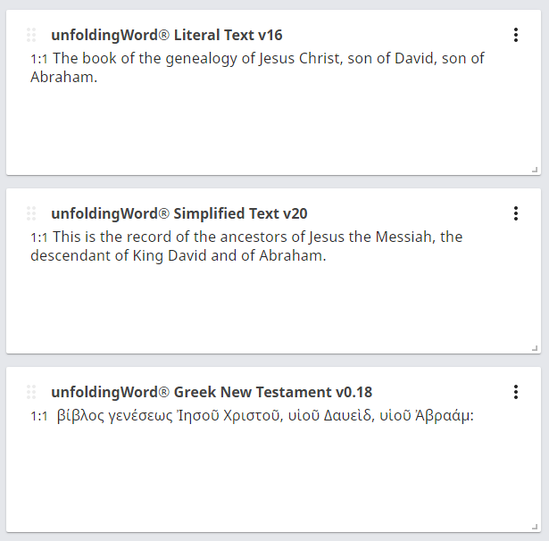

# Design for Admin App PoC

Issue: https://github.com/unfoldingWord/tc-create-app/issues/713

The linked issue above contains the original requirements

## Logic and Flow

**Purpose**: Admin does a health check of files prior to assigning translation work.

**Initialization Steps**:
1. Log in
2. Select Organization
3. Select Language
4. Select Resource Type 
	- Alternate 1: include an "all resource types" selection
	- Alternate 2: just automatically check all resource types

**Repo Check Steps** (based on what is selected above):
1. Does repo exist?
2. If yes, then proceed to manifest check steps. Otherwise continue.
3. Offer two options: 
	- Create the repo
	- Rename an existing repo to conform to standard naming
4. If 'create', then create it; then done
5. If 'rename' then list all repos in org for given resource type and let admin select one to rename.

**Manifest Check Steps**
1. Does manifest exist in repo?
2. If yes, then done.
3. Show appropriate error message.

## UI/UX Requirements

**Concept**: use create-app 2.0 as the basis.

### Login

In the below, do the following modifications:
1. Rename the app to "translationCore: Admin"
2. Remove the scripture selector on the app bar

### Org and Language Selection

In the below, do the following modifications:
1. Rename page from "Account Settings" to "Admin Settings"
2. Rename form title from "Translation Settings" to just "Settings" (or "Organization and Language Settings")
3. Rename field title from "Primary Translating Language" to "Language"

### Repo and Manifest UI/UX

**Proposal** for all resource types (see below), create one card that implements the repo and manifest checks described above.

In the create app, after the login, org, and language selections, you will get a set of cards like this:

I propose to use the same concept where one card is create for each repo. Each card has a grab bar, a title, an action menu, and the body of the card.

In this approach, the title would be reflect the org and repo name, such as:
`ru_gl > ru_tn`.

For PoC phase 1: the content of the card would indicate the results of the repo and manifest checks.

For PoC phase 2: the content of the card would allow missing repos to be created or existing repos to be renamed to standard naming conventions (*langId*\_*resourceId*).

**Resource Types**

*For scripture:*
- Translation Notes (tn)
- Translation Academy (ta)
- Translation Words (tw)
- Translation Words List (twl)
- Translation Questions (tq)
- Study Notes (sn)
- Study Questions( sq)
- Literal Translation (glt)
- Simplified Translation (gst)

*For Open Bible Stories:*
- OBS (obs)
- OBS Translation Notes (obs_tn)
- OBS Study Questions (obs_sq)
- OBS Study Notes (obs_sn)

