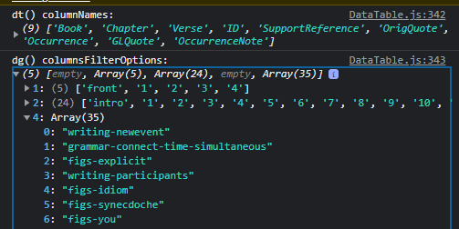
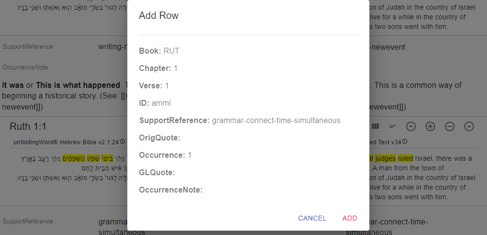

# Issue 76
Link: https://github.com/unfoldingWord/tc-create-app/issues/76

## Issue Description
Users want to see the exact options that are available for the RC links needed for supportreferences in the TNs. Users should be able to type ahead any of the Support References that are already in the document. Users need to be able to select from a list, enter custom text or a blank field.

DoD: Users can pick a TA article from a type-ahead drop-down for TNs.

## Technical Description

1. The dropdown feature will only be available on fields designated as "filterable".
2. The choices shown in dropdown will be those already in the file.
3. The user must be able to enter a new value that isn't shown

NOTE: In some cases the total list of allowed values is actually known. And the approach described above does not account showing the complete list and preventing something new, and possibly invalid, to be entered. See Appendix A for a different approach that would work this for those columns that have a finite known list of valid values.

## 2022-05-18

### tc-create
In tc-create's TranslatableTSV.js, the columns for the filter function are discovered and found:
```js
  const config = useDeepCompareMemo(() => {
    let _config = {
      rowHeader,
      compositeKeyIndices: compositeKeyIndicesFromColumnNames({ columnNames }),
      columnsFilter: columnsFilterFromColumnNames({ columnNames }),
      columnsShowDefault: columnsShowDefaultFromColumnNames({ columnNames }),
    };
```

This config object is passed:
```html
      <DataTable
        sourceFile={sourceContent}
        targetFile={cachedContent || targetContent}
        onSave={onSave}
        onEdit={onEdit}
        onValidate={onValidate}
        onContentIsDirty={onContentIsDirty}
        delimiters={delimiters}
        config={config}
        generateRowId={_generateRowId}
        options={options}
        parser={parser}
      />
```

Let's look at the function `columnsFilterFromColumnNames()`. 

Imported:
```js
import {
  columnNamesFromContent,
  columnsFilterFromColumnNames,
  columnsShowDefaultFromColumnNames,
  compositeKeyIndicesFromColumnNames,
  generateRowId,
} from './helpers';
```

Code:
```js
export const columnsFilterFromColumnNames = ({ columnNames }) => {
  const columnNamesToUse = ['Reference', 'Chapter', 'Verse', 'SupportReference'];

  const indices = columnNamesToUse.map(columnName => {
    const index = columnIndexOfColumnNameFromColumnNames({ columnNames, columnName });
    return index;
  });

  const columnsIndices = indices.filter(index => (index > -1));
  const columnsFilter = columnsIndices.map(index => (columnNames[index]));

  return columnsFilter;
};
```

So from a selected list of potentials, the actual column headers are examined to see which are present. 

What if we added to the config object an array of values in a filterable column? **Not a good idea, since users could add a row with a new value and will expect the new value to be in the dropdown after that.**

This means the dropdown list must be computed in datatable-translatable(d-t). Since d-t has the config object it will know which are the filterable columns and thus which ones to look at.

### datatable-translatable

First note that DataTable.js actually exports by default `<DataTableWrapper />`:

```js
export default function DataTableWrapper(props) {
  return (
    <MarkdownContextProvider>
      <DataTableContextProvider {...props}>
        <DataTable {...props} />
      </DataTableContextProvider>
    </MarkdownContextProvider>
  );
}
```

Note also that all the parametes are passed in via "props".

So it isn't self-documenting what is going on...

In the function DataTable, we find:
```js
  const { state, actions } = useContext(DataTableContext);
  const {
    columnNames, data, columnsFilterOptions,
  } = state;
```

And further, the filter options is actually what we need for the dropdown list. Thus we are all set. Snippet:



When the add row button is clicked, this non-editable form is presented. You can only cancel or add. Once added you can edit the row content as needed.



# Appendix A 
**Assumption**
It is assumed that a GL may not create a language specific Translation Academy articles. If new articles are permitted, then the below would need to be adjusted slightly.

Consider the support refence column, which has 177 valid values as of this writing. Here is sketch of how tc-create could restrict the choices to these values.

- Obtain the list of valid values at run time.
- When a tN resource is being edited, pass an optional parameter to the instance of datatable-translatable.
- This parameter would be an object where:
	- The key is the column header value, namely, `SupportReference`
	- The value would be an array of the valid values
- When the user attempts to enter a value for support reference, the component would use the autocomplete feature of the dropdown to permit easy selection of the desired value.

